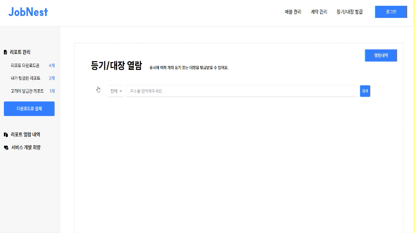
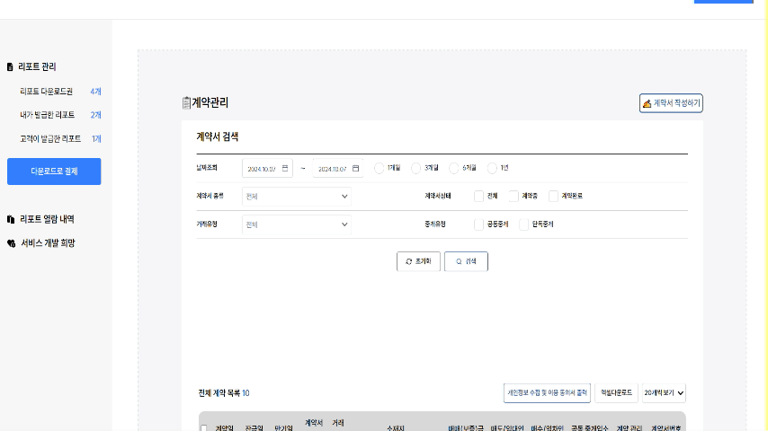
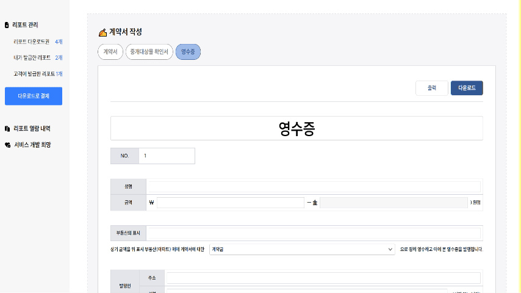
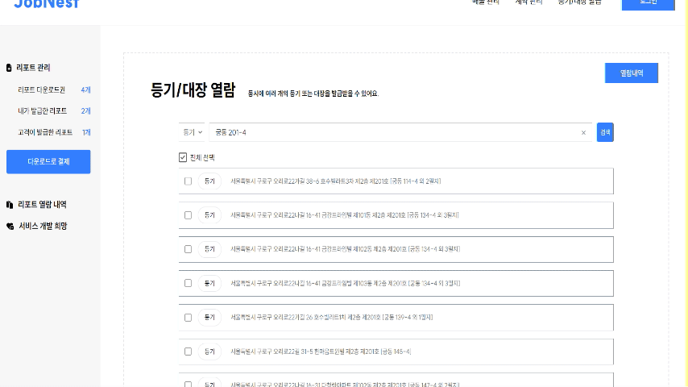

# JobNest
※ 해당 프로젝트는 (주)테라파이에서 요청받아 협업하여 진행하였습니다.
## 📆 개발기간
2024.09.02 ~ 2024.09.27
## ✨ 배포주소
[https://jobnest-contract](https://jobnest-contract.netlify.app/)


## 🛠 기술스택
### ▪FE


### ▪협업툴


## 📋 주요 기능
### ▪ 홈 대시보드


### ▪ 할 일 목록과 구글 캘린더 연동



### ▪ 계약 검색 및 작성 관리






### ▪ 등기 대장 열람




## 💻 파일 구조
```
📦src
 ┣ 📂assets
 ┃ ┣ 📂images
 ┃ ┃ ┣ 📜24testimg.png
 ┃ ┃ ┣ 📜clipboard.png
 ┃ ┃ ┗ 📜menubar.png
 ┃ ┣ 📜Loader.css
 ┃ ┗ 📜reset.css
 ┣ 📂components
 ┃ ┣ 📂CalendarManagement
 ┃ ┃ ┣ 📜ConfirmationModal.tsx
 ┃ ┃ ┣ 📜FlashNotification.tsx
 ┃ ┃ ┣ 📜FullCalendarComponent.tsx
 ┃ ┃ ┣ 📜GoogleCalendarAuth.tsx
 ┃ ┃ ┣ 📜GoogleCalendarButton.tsx
 ┃ ┃ ┣ 📜ManageCalendar.tsx
 ┃ ┃ ┗ 📜ModalAlert.tsx
 ┃ ┣ 📂ContractManagement
 ┃ ┃ ┣ 📂Drafting
 ┃ ┃ ┃ ┣ 📂Common
 ┃ ┃ ┃ ┃ ┣ 📜ContractBtn.tsx
 ┃ ┃ ┃ ┃ ┣ 📜ContractDate.tsx
 ┃ ┃ ┃ ┃ ┣ 📜ContractDropDown.tsx
 ┃ ┃ ┃ ┃ ┣ 📜ContractInput.tsx
 ┃ ┃ ┃ ┃ ┣ 📜ContractRadio.tsx
 ┃ ┃ ┃ ┃ ┣ 📜ContractRadioInput.tsx
 ┃ ┃ ┃ ┃ ┣ 📜ContractRadioInputText.tsx
 ┃ ┃ ┃ ┃ ┗ 📜ContractRadioWithSubOptions.tsx
 ┃ ┃ ┃ ┣ 📂ConfirmationDocument
 ┃ ┃ ┃ ┃ ┣ 📂FirstPage
 ┃ ┃ ┃ ┃ ┃ ┣ 📜index.tsx
 ┃ ┃ ┃ ┃ ┃ ┣ 📜LeaseConfirmationItems.tsx
 ┃ ┃ ┃ ┃ ┃ ┣ 📜Notes.tsx
 ┃ ┃ ┃ ┃ ┃ ┣ 📜PropertyDescription.tsx
 ┃ ┃ ┃ ┃ ┃ ┣ 📜PropertyRights.tsx
 ┃ ┃ ┃ ┃ ┃ ┣ 📜TenantConfirmation.tsx
 ┃ ┃ ┃ ┃ ┃ ┗ 📜VerificationExplanation.tsx
 ┃ ┃ ┃ ┃ ┣ 📂LastPage
 ┃ ┃ ┃ ┃ ┃ ┣ 📜CalculationDetails.tsx
 ┃ ┃ ┃ ┃ ┃ ┣ 📜HowToWrite.tsx
 ┃ ┃ ┃ ┃ ┃ ┣ 📜index.tsx
 ┃ ┃ ┃ ┃ ┃ ┣ 📜PeopleInfo.tsx
 ┃ ┃ ┃ ┃ ┃ ┗ 📜Signiture.tsx
 ┃ ┃ ┃ ┃ ┣ 📂SecondPage
 ┃ ┃ ┃ ┃ ┃ ┣ 📜DetailsOfRights.tsx
 ┃ ┃ ┃ ┃ ┃ ┣ 📜ExpectedTransactionAmount.tsx
 ┃ ┃ ┃ ┃ ┃ ┣ 📜index.tsx
 ┃ ┃ ┃ ┃ ┃ ┣ 📜LandPlanning.tsx
 ┃ ┃ ┃ ┃ ┃ ┣ 📜LocationConditions.tsx
 ┃ ┃ ┃ ┃ ┃ ┣ 📜Tax.tsx
 ┃ ┃ ┃ ┃ ┃ ┗ 📜UnwantedFacility.tsx
 ┃ ┃ ┃ ┃ ┣ 📂ThirdPage
 ┃ ┃ ┃ ┃ ┃ ┣ 📜ConditionOfInternalExternalFacilities.tsx
 ┃ ┃ ┃ ┃ ┃ ┣ 📜EnvironmentInformation.tsx
 ┃ ┃ ┃ ┃ ┃ ┣ 📜index.tsx
 ┃ ┃ ┃ ┃ ┃ ┣ 📜PropertyRights.tsx
 ┃ ┃ ┃ ┃ ┃ ┗ 📜WallpaperCondition.tsx
 ┃ ┃ ┃ ┃ ┗ 📜index.tsx
 ┃ ┃ ┃ ┣ 📂Contract
 ┃ ┃ ┃ ┃ ┣ 📜Agency.tsx
 ┃ ┃ ┃ ┃ ┣ 📜B.tsx
 ┃ ┃ ┃ ┃ ┣ 📜ConfirmationSection.tsx
 ┃ ┃ ┃ ┃ ┣ 📜ContractContent.tsx
 ┃ ┃ ┃ ┃ ┣ 📜index.tsx
 ┃ ┃ ┃ ┃ ┣ 📜LegalProvision.tsx
 ┃ ┃ ┃ ┃ ┣ 📜RealEstate.tsx
 ┃ ┃ ┃ ┃ ┣ 📜TopBtn.tsx
 ┃ ┃ ┃ ┃ ┣ 📜TopVar.tsx
 ┃ ┃ ┃ ┃ ┗ 📜TransactionForm.tsx
 ┃ ┃ ┃ ┣ 📂Pre
 ┃ ┃ ┃ ┃ ┣ 📜DraftBtn.tsx
 ┃ ┃ ┃ ┃ ┣ 📜DraftDropDown.tsx
 ┃ ┃ ┃ ┃ ┣ 📜index.tsx
 ┃ ┃ ┃ ┃ ┗ 📜SearchInput.tsx
 ┃ ┃ ┃ ┗ 📂Receipt
 ┃ ┃ ┃ ┃ ┣ 📜index.tsx
 ┃ ┃ ┃ ┃ ┣ 📜ReceiptDate.tsx
 ┃ ┃ ┃ ┃ ┗ 📜ReceiptDropDown.tsx
 ┃ ┃ ┗ 📂Search
 ┃ ┃ ┃ ┣ 📜Btn.tsx
 ┃ ┃ ┃ ┣ 📜index.tsx
 ┃ ┃ ┃ ┣ 📜SearchBtn.tsx
 ┃ ┃ ┃ ┣ 📜SearchCheck.tsx
 ┃ ┃ ┃ ┣ 📜SearchDate.tsx
 ┃ ┃ ┃ ┣ 📜SearchDropDown.tsx
 ┃ ┃ ┃ ┣ 📜SearchRadio.tsx
 ┃ ┃ ┃ ┣ 📜SearchResults.tsx
 ┃ ┃ ┃ ┣ 📜SearchResultsBtn.tsx
 ┃ ┃ ┃ ┣ 📜SearchResultsDropDown.tsx
 ┃ ┃ ┃ ┣ 📜Spinner.tsx
 ┃ ┃ ┃ ┗ 📜WarningIcon.tsx
 ┃ ┣ 📂Layout
 ┃ ┃ ┣ 📜Header.tsx
 ┃ ┃ ┗ 📜LeftMenu.tsx
 ┃ ┣ 📂Main
 ┃ ┃ ┣ 📂bookmark
 ┃ ┃ ┃ ┣ 📜BookMarkAdd.tsx
 ┃ ┃ ┃ ┣ 📜BookMarkEdit.tsx
 ┃ ┃ ┃ ┣ 📜BookMarkList.tsx
 ┃ ┃ ┃ ┗ 📜BookMarkManageModal.tsx
 ┃ ┃ ┣ 📜FullCalender.tsx
 ┃ ┃ ┣ 📜MainPage.tsx
 ┃ ┃ ┗ 📜ToDoApp.tsx
 ┃ ┣ 📂Notification
 ┃ ┃ ┗ 📜Notification.tsx
 ┃ ┗ 📂RegistrationIssuance
 ┃ ┃ ┣ 📜RegistrationIssuanceHistoryTable.tsx
 ┃ ┃ ┣ 📜RegistrationIssuanceMain.tsx
 ┃ ┃ ┗ 📜RegistrationIssuanceViewHistory.tsx
 ┣ 📂redux
 ┃ ┣ 📜contractSlice.ts
 ┃ ┣ 📜loginSlice.ts
 ┃ ┗ 📜store.ts
 ┣ 📂types
 ┃ ┣ 📜global.d.ts
 ┃ ┣ 📜html2pdf.js.d.ts
 ┃ ┣ 📜react-table-config.d.ts
 ┃ ┗ 📜react-table.d.ts
 ┣ 📂views
 ┃ ┣ 📂RegistrationIssuance
 ┃ ┃ ┣ 📜RegistrationIssuanceMainView.tsx
 ┃ ┃ ┗ 📜RegistrationIssuanceViewHistroyView.tsx
 ┃ ┣ 📜ContractDraftingView.tsx
 ┃ ┣ 📜ContractManagementView.tsx
 ┃ ┗ 📜MainView.tsx
 ┣ 📜App.tsx
 ┣ 📜index.css
 ┣ 📜key
 ┣ 📜key.pub
 ┣ 📜Layout.tsx
 ┣ 📜main.tsx
 ┗ 📜vite-env.d.ts
```

## 👨‍💻 팀원
| 이름     | 역할                                    |
| -------- | --------------------------------------- |
| 민의균   | 메인화면 스케줄 관리   |
| 박소윤 👑 | 계약관리 전체          |
| 박지우   | 메인화면 즐겨찾기, 등기대장 관리               |
| 조세은   | 메인화면 할 일 목록               |


